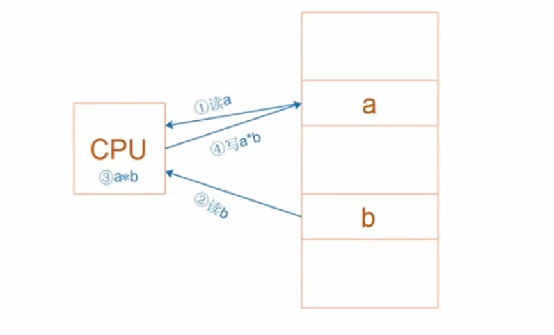
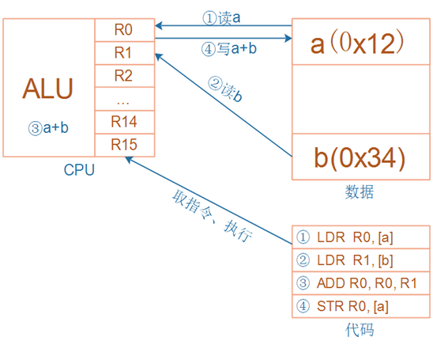
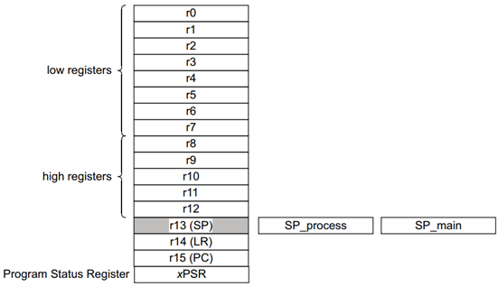

# [FreeRTOS]Day2

## 创建第一个多任务程序

目标：创建两个任务，任务A运行`LED_Test()`，任务B运行`OLED_Test()`

如果在`StartDefaultTask()`直接写

```c
void StartDefaultTask(void *argument)
{
  /* USER CODE BEGIN StartDefaultTask */
  /* Infinite loop */
  for(;;)
  {
	OLED_Test();
    Led_Test();
  }
  /* USER CODE END StartDefaultTask */
}
```

由于`OLED_Test()`和`Led_Test()`都是死循环

```c
void OLED_Test(void)
{
//	int cnt = 0;
    OLED_Init();
	// 清屏
	OLED_Clear();
    
	while (1)
	{
		// 在(0, 0)打印'A'
		OLED_PutChar(0, 0, 'A');
		// 在(1, 0)打印'Y'
		OLED_PutChar(1, 0, 'Y');
		// 在第0列第2页打印一个字符串"Hello World!"
		OLED_PrintString(0, 2, "Hello World!");
//		OLED_PrintSignedVal(0, 4, cnt++);
	}
}

void Led_Test(void)
{
    Led_Init();

    while (1)
    {
        Led_Control(LED_GREEN, 1);
        mdelay(500);

        Led_Control(LED_GREEN, 0);
        mdelay(500);
    }
}

```

因此只会执行一个任务，如何让两个死循环都执行呢？

思路：默认任务中运行`OLED_Test()`，新建一个任务运行`LED_Test()`

## 创建任务

在FreeRTOS中，任务就是一个函数，创建任务的函数为`xTaskCreate()`

```c
BaseType_t xTaskCreate(
         TaskFunction_t pxTaskCode, // 函数指针, 任务函数
         const char * const pcName, // 任务的名字
         const configSTACK_DEPTH_TYPE usStackDepth, // 栈大小,单位为word,10表示40字节
         void * const pvParameters, // 调用任务函数时传入的参数
         UBaseType_t uxPriority, // 优先级
         TaskHandle_t * const pxCreatedTask ); // 任务句柄, 以后使用它来操作这个任务
```

**任务函数与任务：任务函数规定任务执行什么代码，任务是任务函数的一次独立运行实例。**

任务函数本质上就是一个普通的 C 函数，但它必须符合 FreeRTOS 要求的函数形式

```C
void TaskFunction(void *pvParameters)	// void *pvParameters用来接收参数
{
    while (1)
    {
        // 任务需要反复执行的代码
    }
}
```

任务是 FreeRTOS 内核管理的一个独立运行实体。创建任务时，FreeRTOS 不只是调用一次任务函数，还会为这个任务分配或建立独立的任务栈，任务控制块 TCB，任务优先级......

**一个任务函数可以对应多个任务，多个任务可以执行同一个任务函数**

创建一个任务函数`LED_Test_Task()`执行板载LED的测试

```c
/* Private function prototypes -----------------------------------------------*/
/* USER CODE BEGIN FunctionPrototypes */
void LEDTestTask(void *argument)
{
	while(1) {
		Led_Test();
	}
}
/* USER CODE END FunctionPrototypes */
```

使用`xTaskCreate()`创建一个任务

```c
xTaskCreate(LED_Test_Task, "LED_Test", 128, NULL, osPriorityNormal, NULL);
```

烧录后可以观察到`LED_Test()`和`OLED_Test()`对应现象同时存在

## ARM架构简明教程

ARM芯片属于精简指令集计算机（RISC），它所用的指令比较简单，有以下特点：

- 对内存只有读、写指令
- 对于数据的运算是在CPU内部实现的
- 使用RISC指令的CPU复杂度小，易于设计

执行命令a=a\*b的过程如下：从内存中读取a的值到CPU，从内存中读取b的值到CPU，计算a\*b，将结果写回a



### CPU内部寄存器



CPU内部有R0，R1，......，R15共16个普通寄存器，可以用来暂存数据，此外还有一个**程序状态寄存器PSR**



对于R13、R14、R15还有其他用途

R13：别名**SP（Stack Pointer）**，栈指针

R14：别名**LR（Link Register）**，用来保存返回地址

R15：别名**PC（Program Counter）**，程序计数器，标识当前指令地址，写入新值即可跳转

### 汇编指令

读内存：Load

```shell
# 示例
LDR  R0, [R1, #4]  ; 读地址"R1+4", 得到的4字节数据存入R0
```

写内存：Store

```shell
# 示例
STR  R0, [R1, #4]  ; 把R0的4字节数据写入地址"R1+4"
```

加减

```shell
ADD R0, R1, R2  ; R0=R1+R2
ADD R0, R0, #1  ; R0=R0+1
SUB R0, R1, R2  ; R0=R1-R2
SUB R0, R0, #1  ; R0=R0-1
```

比较

```shell
CMP R0, R1  ; 结果保存在PSR(程序状态寄存器)
```

跳转

```shell
B  main  ; Branch, 直接跳转
BL main  ; Branch and Link, 先把返回地址保存在LR寄存器里再跳转
```
