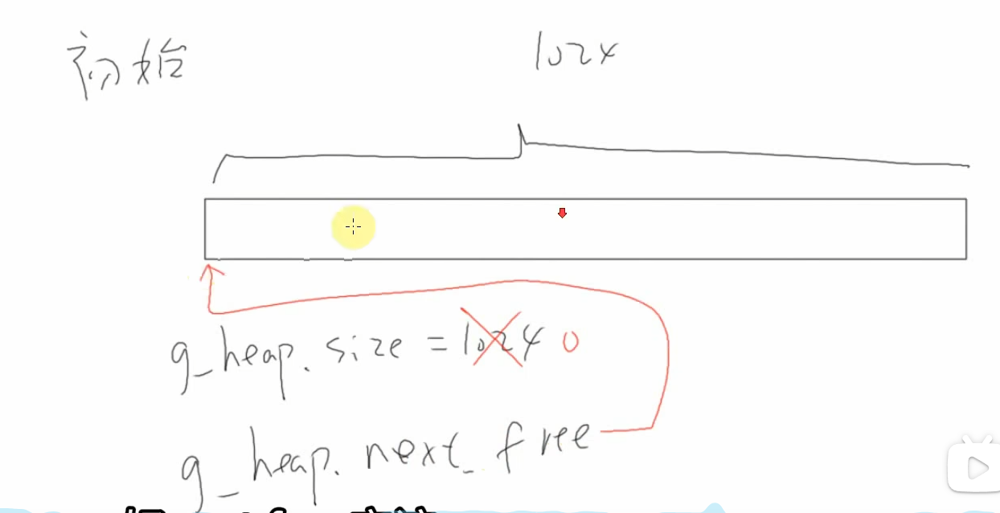
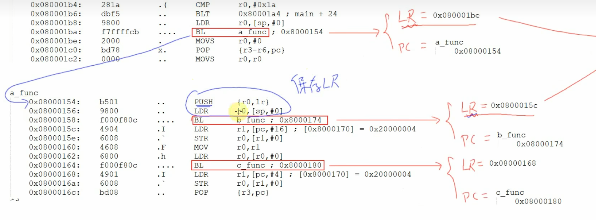
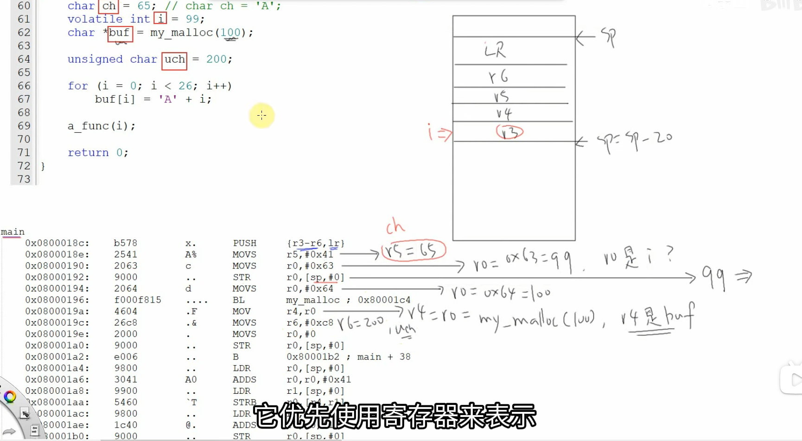
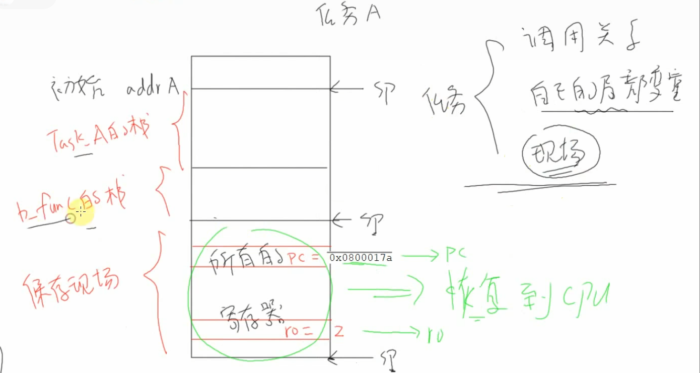

# [FreeRTOS]Day3

## 堆

堆是一块空闲的内存，可以进行内存的分配和释放

```c
char heap_buf[1024]			// 一块空闲的内存作为堆
int pos = 0;
// 内存分配
void *my_malloc(int size)
{
    int old_pos = pos;
    pos += size;
    return &heap_buf[old_pos];
}

// 释放函数
void *my_free(void *buf)
{
    // 无法实现
}

// void *是C/C++中的无类型指针（也称泛型指针或万能指针），最大的特点是：只存储内存地址，不关心该地址上存储的数据是什么类型
```

为什么上面的代码无法实现释放函数？

释放时只知道释放空间的起始地址，不知道需要释放多大的空间

如何解决这个问题？

在分配函数`my_malloc()`实现时，除了分配`size`大小的空间外，额外分配一个头部，记录本次分配的空间大小，例如`my_malloc(100)`，分配“头部+100字节”的空间，返回100字节的起始地址

释放空间时，在传入地址`buf`的基础上，减去头部的大小，就可以得到该段空间的大小信息

多次分配和释放后，可能出现可分配空间离散的情况，如何管理？

使用链表

```c
struct available_space {
    int size;
    struct available_space *next;
}
```



## 栈

栈也是一块内存空间，CPU的SP寄存器指向它，可以用于函数调用、局部变量、多任务系统里保存现场

调用函数的本质：调用BL指令，使LR = 下一条指令地址（返回地址），PC = 调用函数地址

当调用关系为

```c
main()
    a_func()
    	b_func()
    	c_func()
```

时，在`a_func()`中调用`b_func()`会使LR从`a_func()`的下一条指令地址变为`b_func()`的下一条指令地址，那么程序最终如何返回到`a_func()`的下一条指令？

此外：局部变量在栈中是如何分配的？为什么RTOS中每个任务都要有自己的栈？

（1）每个函数开始执行时，都会先将LR压入栈，各函数压入栈的值被称为该函数的栈。函数执行结束前，存储的值从栈中弹出，称为函数的栈被回收



在函数入口实现：

- 划分出自己的栈
- 将LR压入栈
- 将局部变量压入栈

（2）寄存器位于CPU中，局部变量可能保存在寄存器中，也可能直接保存在栈内（未开启优化或寄存器不够的情况下）



（3）每个任务都有自己的调用关系，局部变量和现场，这些都要在栈中保存

