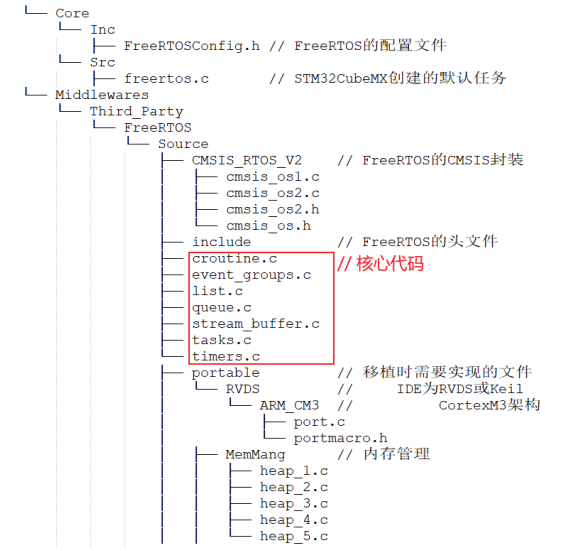
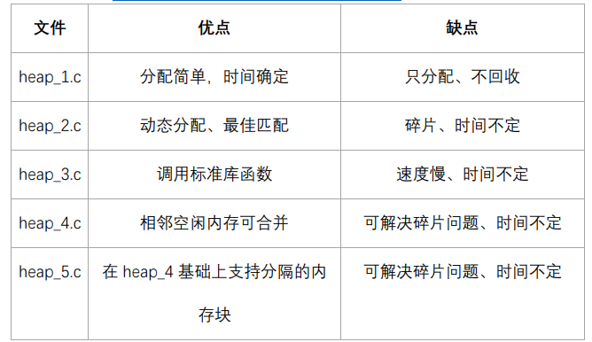

# [FreeRTOS]Day4

## FreeRTOS源码概述

使用STM32CubeMX创建的FreeRTOS工程中，FreeRTOS的相关源码如下

## 内存管理

内存管理就是堆管理。使用内存的动态分配：用到时分配，不使用时释放，可以简化程序设计。

STM32CubeMX中关于内存管理的设置

**5中内存管理方法**

FreeRTOS中内存管理的接口函数为：pvPortMalloc 、vPortFree，对应于C库的malloc、 free

5中内存管理方法定义在5个文件当中

