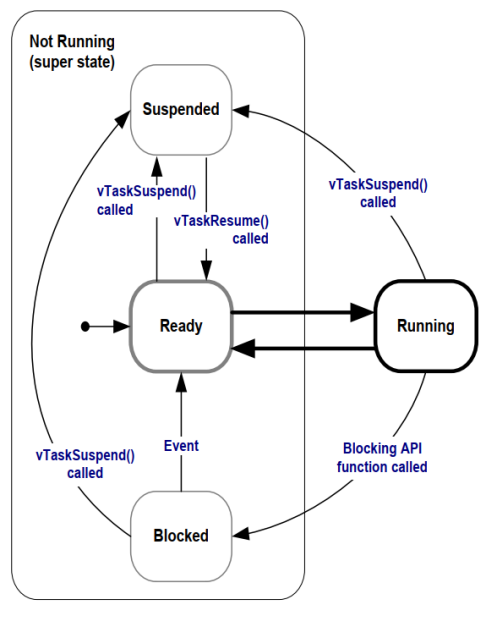
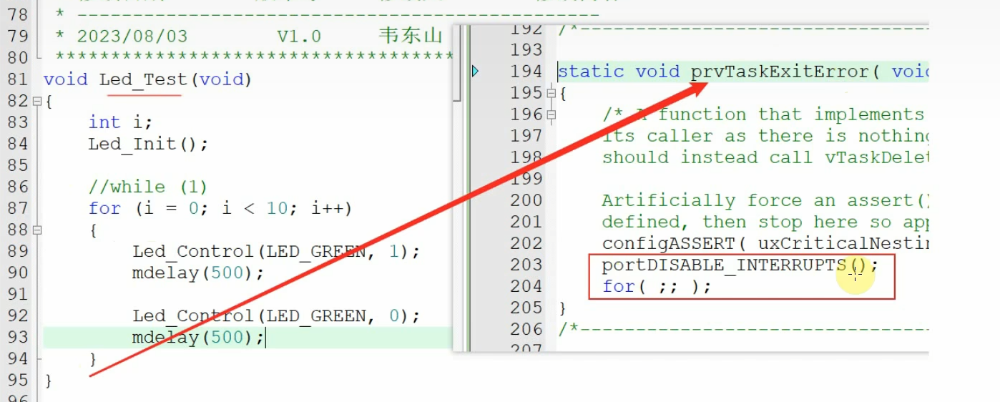

# [FreeRTOS]Day5

## 任务管理

任务就是要执行的一些操作，定义在任务函数之中，通过`xTaskCreate()`等函数创建任务（线程）执行响应的任务

任务的要素：（1）函数规定任务要执行什么动作（2）栈用来保存任务执行时的返回地址、局部变量等重要信息，还要有TCB**（Task Control Block，任务控制块）**（3）优先级用来实现不同任务之间的调度

```c
void ATaskFunction( void *pvParameters )
{
    /* 对于不同的任务，局部变量放在任务的栈里，有各自的副本 */
    int32_t lVariableExample = 0;
     /* 任务函数通常实现为一个无限循环 */
    for( ;; )
    {
    /* 任务的代码 */
    }
     /* 如果程序从循环中退出，一定要使用vTaskDelete删除自己
     * NULL表示删除的是自己
     */
    vTaskDelete( NULL );

     /* 程序不会执行到这里, 如果执行到这里就出错了 */
}
```

创建任务的函数根据内存分配方式分为**动态分配内存**和**静态分配内存**

使用动态分配内存的任务创建函数为：

```c
BaseType_t xTaskCreate(
    TaskFunction_t pxTaskCode, // 函数指针, 任务函数
    const char * const pcName, // 任务的名字
    const configSTACK_DEPTH_TYPE usStackDepth, // 栈大小,单位为word,10表示40字节
    void * const pvParameters, // 调用任务函数时传入的参数
    UBaseType_t uxPriority, // 优先级
    TaskHandle_t * const pxCreatedTask ); // 任务句柄, 以后使用它来操作这个任务
}
```

使用静态分配内存的任务创建函数为：

```c
TaskHandle_t xTaskCreateStatic (
    TaskFunction_t pxTaskCode, // 函数指针, 任务函数
    const char * const pcName, // 任务的名字
    const uint32_t ulStackDepth, // 栈大小,单位为word,10表示40字节
    void * const pvParameters, // 调用任务函数时传入的参数
    UBaseType_t uxPriority, // 优先级
    StackType_t * const puxStackBuffer, // 静态分配的栈，就是一个buffer
    StaticTask_t * const pxTaskBuffer // 静态分配的任务结构体TCB的指针，用它来操作这个任务
);
```

二者区别可以理解为：`xTaskCreate()`只需要告诉FreeRTOS需要多大的内存，由FreeRTOS自动分配；`xTaskCreateStatic()`需要自己制定TCB和栈，供FreeRTOS使用

要实现的任务：

- 声：使用无源蜂鸣器播放音乐
- 光：板载LED闪烁
- 色：全彩LED变色
- 影：监测遥控器并在LCD上显示

```c
/* USER CODE BEGIN Header */
#include "driver_led.h"
#include "driver_lcd.h"
#include "driver_mpu6050.h"
#include "driver_timer.h"
#include "driver_ds18b20.h"
#include "driver_dht11.h"
#include "driver_active_buzzer.h"
#include "driver_passive_buzzer.h"
#include "driver_color_led.h"
#include "driver_ir_receiver.h"
#include "driver_ir_sender.h"
#include "driver_light_sensor.h"
#include "driver_ir_obstacle.h"
#include "driver_ultrasonic_sr04.h"
#include "driver_spiflash_w25q64.h"
#include "driver_rotary_encoder.h"
#include "driver_motor.h"
#include "driver_key.h"
#include "driver_uart.h"

/**
  ******************************************************************************
  * File Name          : freertos.c
  * Description        : Code for freertos applications
  ******************************************************************************
  * @attention
  *
  * Copyright (c) 2023 STMicroelectronics.
  * All rights reserved.
  *
  * This software is licensed under terms that can be found in the LICENSE file
  * in the root directory of this software component.
  * If no LICENSE file comes with this software, it is provided AS-IS.
  *
  ******************************************************************************
  */
/* USER CODE END Header */

/* Includes ------------------------------------------------------------------*/
#include "FreeRTOS.h"
#include "task.h"
#include "main.h"
#include "cmsis_os.h"

/* Private includes ----------------------------------------------------------*/
/* USER CODE BEGIN Includes */

/* USER CODE END Includes */

/* Private typedef -----------------------------------------------------------*/
/* USER CODE BEGIN PTD */

/* USER CODE END PTD */

/* Private define ------------------------------------------------------------*/
/* USER CODE BEGIN PD */

/* USER CODE END PD */

/* Private macro -------------------------------------------------------------*/
/* USER CODE BEGIN PM */

/* USER CODE END PM */

/* Private variables ---------------------------------------------------------*/
/* USER CODE BEGIN Variables */
static StackType_t g_pucStackOfLightTask[128];
static StaticTask_t g_TCBOfLightTask;		// 光任务TCB
static TaskHandle_t xLightTaskHandle;			// 光任务的任务句柄，接收静态分配内存任务创建函数的返回值

static StackType_t g_pucStackOfColorTask[128];
static StaticTask_t g_TCBOfColorTask;		// 色任务TCB
static TaskHandle_t xColorTaskHandle;			// 色任务的任务句柄，接收静态分配内存任务创建函数的返回值

/* USER CODE END Variables */
/* Definitions for defaultTask */
osThreadId_t defaultTaskHandle;
const osThreadAttr_t defaultTask_attributes = {
  .name = "defaultTask",
  .stack_size = 128 * 4,
  .priority = (osPriority_t) osPriorityNormal,
};

/* Private function prototypes -----------------------------------------------*/
/* USER CODE BEGIN FunctionPrototypes */

/* USER CODE END FunctionPrototypes */

void StartDefaultTask(void *argument);

void MX_FREERTOS_Init(void); /* (MISRA C 2004 rule 8.1) */

/**
  * @brief  FreeRTOS initialization
  * @param  None
  * @retval None
  */
void MX_FREERTOS_Init(void) {
  /* USER CODE BEGIN Init */
	TaskHandle_t xSoundTaskHandle;			// 声音任务的任务句柄
	BaseType_t ret;		// 接收任务创建函数的返回值
  /* USER CODE END Init */

  /* USER CODE BEGIN RTOS_MUTEX */
  /* add mutexes, ... */
  /* USER CODE END RTOS_MUTEX */

  /* USER CODE BEGIN RTOS_SEMAPHORES */
  /* add semaphores, ... */
  /* USER CODE END RTOS_SEMAPHORES */

  /* USER CODE BEGIN RTOS_TIMERS */
  /* start timers, add new ones, ... */
  /* USER CODE END RTOS_TIMERS */

  /* USER CODE BEGIN RTOS_QUEUES */
  /* add queues, ... */
  /* USER CODE END RTOS_QUEUES */

  /* Create the thread(s) */
  /* creation of defaultTask */
	defaultTaskHandle = osThreadNew(StartDefaultTask, NULL, &defaultTask_attributes);

  /* USER CODE BEGIN RTOS_THREADS */
  /* add threads, ... */
  /* 创建任务：声：无源蜂鸣器播放音乐 */
	extern void PlayMusic(void *params);
//	ret = xTaskCreate(PlayMusic, "SoundTask", 128, NULL, osPriorityNormal, &xSoundTaskHandle);
  
  /* 创建任务：光：板载LED闪烁 */
	xLightTaskHandle = xTaskCreateStatic(Led_Test, "LightTask", 128, NULL, osPriorityNormal, g_pucStackOfLightTask, &g_TCBOfLightTask);
  
  /* 创建任务：色：全彩LED变色 */
	xColorTaskHandle = xTaskCreateStatic(ColorLED_Test, "ColorTask", 128, NULL, osPriorityNormal, g_pucStackOfColorTask, &g_TCBOfColorTask);
	
  /* USER CODE END RTOS_THREADS */

  /* USER CODE BEGIN RTOS_EVENTS */
  /* add events, ... */
  /* USER CODE END RTOS_EVENTS */

}

/* USER CODE BEGIN Header_StartDefaultTask */

/**
  * @brief  Function implementing the defaultTask thread.
  * @param  argument: Not used
  * @retval None
  */
/* USER CODE END Header_StartDefaultTask */
void StartDefaultTask(void *argument)
{
  /* USER CODE BEGIN StartDefaultTask */
  /* Infinite loop */
  LCD_Init();
  LCD_Clear();
  
  for(;;)
  {
    //Led_Test();
    //LCD_Test();
	//MPU6050_Test(); 
	//DS18B20_Test();
	//DHT11_Test();
	//ActiveBuzzer_Test();
	//PassiveBuzzer_Test();
	//ColorLED_Test();
	  IRReceiver_Test();  /* 默认任务执行监控遥控器并在OLED上显示 */
	//IRSender_Test();
	//LightSensor_Test();
	//IRObstacle_Test();
	//SR04_Test();
	//W25Q64_Test();
	//RotaryEncoder_Test();
	//Motor_Test();
	//Key_Test();
	//UART_Test();
  }
  /* USER CODE END StartDefaultTask */
}

/* Private application code --------------------------------------------------*/
/* USER CODE BEGIN Application */

/* USER CODE END Application */


```

## 栈大小的估算

栈中保存的信息：返回地址（LR及其他寄存器）、局部变量、函数现场（16个寄存器共16*4=64Byte）

返回地址占用栈大小由函数调用深度决定，当存在5级调用时A->B->C->D->E时，需要保存的寄存器最多有5\*（被调用者寄存器R4-R11 + LR = 9个）= 45个寄存器 = 45 \* 4Byte = 18Byte

局部变量占用栈大小由局部变量的数量和大小决定

## 使用同一任务函数创建不同任务

完成任务函数

```c
struct TaskPrintInfo {
	uint8_t x;
	uint8_t y;
	char name[16];
};

// 任务函数：在OLED指定位置打印
void OLEDPrintTask(void *param)
{
	struct TaskPrintInfo *pInfo = param;
	uint32_t cnt = 0;
	uint8_t len;
	
	while(1) {
		/* 打印信息 */
		len = LCD_PrintString(pInfo->x, pInfo->y, pInfo->name);
		len = LCD_PrintString(len, pInfo->y, ":");
		LCD_PrintSignedVal(len, pInfo->y, cnt++);
	}
}
```

创建三个任务

```c
static struct TaskPrintInfo g_Task1Info = {0, 0, "Task1"};
static struct TaskPrintInfo g_Task2Info = {0, 3, "Task2"};
static struct TaskPrintInfo g_Task3Info = {0, 6, "Task3"};

	xTaskCreate(OLEDPrintTask, "Task1", 128, &g_Task1Info, osPriorityNormal, NULL);
	xTaskCreate(OLEDPrintTask, "Task2", 128, &g_Task2Info, osPriorityNormal, NULL);
	xTaskCreate(OLEDPrintTask, "Task3", 128, &g_Task3Info, osPriorityNormal, NULL);
```

使用全局变量使三个任务都能完整打印完字符，避免IIC通信被打断

```c
static uint8_t g_LCDCanUse = 1;

// 任务函数：在OLED指定位置打印
void OLEDPrintTask(void *param)
{
	struct TaskPrintInfo *pInfo = param;
	uint32_t cnt = 0;
	uint8_t len;
	
	while(1) {
		/* 打印信息 */
		if(g_LCDCanUse) {
			g_LCDCanUse = 0;
			len = LCD_PrintString(pInfo->x, pInfo->y, pInfo->name);
			len += LCD_PrintString(len, pInfo->y, ":");
			LCD_PrintSignedVal(len, pInfo->y, cnt++);
			g_LCDCanUse = 1;
		}
		
	}
}
```

添加清屏操作

```c
	LCD_Init();
	LCD_Clear();
```

烧录后只有Task3运行，在任务函数增加一段延时

```c
// 任务函数：在OLED指定位置打印
void OLEDPrintTask(void *param)
{
	struct TaskPrintInfo *pInfo = param;
	uint32_t cnt = 0;
	uint8_t len;
	
	while(1) {
		/* 打印信息 */
		if(g_LCDCanUse) {
			g_LCDCanUse = 0;
			len = LCD_PrintString(pInfo->x, pInfo->y, pInfo->name);
			len += LCD_PrintString(len, pInfo->y, ":");
			LCD_PrintSignedVal(len, pInfo->y, cnt++);
			g_LCDCanUse = 1;
		}
		mdelay(500);
	}
}
```

增加延时后三个任务均运行

**为什么增加延时后三个任务才可以都运行？**

可能是在Task3时间片结束时程序正位于打印字符阶段，此时`g_LCDCanUse`为0，Task3被切换出去，但是Task1，Task2检查`g_LCDCanUse`为0，无法打印对应信息，切换回Task3时，从断点继续执行，所以有且只有Task3能够执行。

**为什么执行顺序是Task3 -> Task1 -> Task2？**

## 删除任务

按下播放按钮，无源蜂鸣器播放音乐，按下电源按钮，停止播放

在默认任务函数中实现

```c
void StartDefaultTask(void *argument)
{
  /* USER CODE BEGIN StartDefaultTask */
  /* Infinite loop */
	LCD_Init();
	LCD_Clear();
  
	uint8_t dev, data;
    int len;
	
    IRReceiver_Init();

    while (1)
    {
        // 读取红外遥控器
		
		// 创建播放音乐任务
		
		// 删除播放音乐任务
    }
  }
  /* USER CODE END StartDefaultTask */
}
```

删除任务函数

```c
void vTaskDelete( TaskHandle_t xTaskToDelete );
```

```c
void StartDefaultTask(void *argument)
{
  /* USER CODE BEGIN StartDefaultTask */
  /* Infinite loop */
	LCD_Init();
	LCD_Clear();
	LCD_PrintString(0, 0, "Waiting");
	
	PassiveBuzzer_Init();
  
	uint8_t dev, data;
    uint8_t len;
	TaskHandle_t xSoundTaskHandle = NULL;			// 声音任务的任务句柄
	BaseType_t ret;		// 接收任务创建函数的返回值
	
    IRReceiver_Init();

    while (1)
    {
        // 读取红外遥控器
		if(IRReceiver_Read(&dev, &data) == 0) {
			if(data == 0xa8) {		// 按下Play
				// 创建播放音乐任务
				extern void PlayMusic(void *params);
				if(xSoundTaskHandle == NULL) {
					ret = xTaskCreate(PlayMusic, "SoundTask", 128, NULL, osPriorityNormal, &xSoundTaskHandle);
					LCD_Clear();
					LCD_PrintString(0, 0, "Task Created");
				}
			} else if(data == 0xa2) {		// 按下Power
				// 删除播放音乐任务
				if(xSoundTaskHandle != NULL) {
					vTaskDelete(xSoundTaskHandle);
					xSoundTaskHandle = NULL;
					PassiveBuzzer_Control(0);		// 停止蜂鸣器
					LCD_Clear();
					LCD_PrintString(0, 0, "Task Deleted");
				}
			}
		}
    }
}
```

## 优先级与阻塞

提高音乐播放任务优先级，修改对应任务函数的延时函数

```c
ret = xTaskCreate(PlayMusic, "SoundTask", 128, NULL, osPriorityNormal + 1, &xSoundTaskHandle);

void MUSIC_Analysis(void){
	uint16_t MusicBeatNum = ((((sizeof(Music_Lone_Brave))/2)/3)-1);
	
	uint16_t MusicSpeed = Music_Lone_Brave[0][2];
	for(uint16_t i = 1;i<=MusicBeatNum;i++){
		//BSP_Buzzer_SetFrequency(Tone_Index[Music_Lone_Brave[i][0]][Music_Lone_Brave[i][1]]);
		PassiveBuzzer_Set_Freq_Duty(Tone_Index[Music_Lone_Brave[i][0]][Music_Lone_Brave[i][1]], 50);
		//HAL_Delay(MusicSpeed/Music_Lone_Brave[i][2]);
//		mdelay(MusicSpeed/Music_Lone_Brave[i][2]);
		vTaskDelay(MusicSpeed/Music_Lone_Brave[i][2]);
	}
}
```

可以实现音乐正常播放（不慢速），遥控器控制播放与停止

## 任务状态

任务有运行（Running）、就绪（Ready）、阻塞（Blocked）和暂停（Suspended）四种状态



任务进入Suspended状态的方法：自己调用`vTaskSuspend()`让自己从Running变为Suspended，别的任务（处于Running）调用`vTaskSuspend()`将其转变为Suspended状态

实现音乐播放/暂停功能

```c
uint8_t bRunning;		// 声音正在播放标志

while (1)
    {
        // 读取红外遥控器
		if(IRReceiver_Read(&dev, &data) == 0) {
			if(data == 0xa8) {		// 按下Play
				// 创建播放音乐任务
				extern void PlayMusic(void *params);
				if(xSoundTaskHandle == NULL) {		// 声音任务还未被创建
					ret = xTaskCreate(PlayMusic, "SoundTask", 128, NULL, osPriorityNormal + 1, &xSoundTaskHandle);
					LCD_Clear();
					LCD_PrintString(0, 0, "Task Created");
				} else {		// 已经被创建
					if(bRunning) {
						// 暂停播放
						vTaskSuspend(xSoundTaskHandle);
						PassiveBuzzer_Control(0);		// 停止蜂鸣器
						LCD_Clear();
						LCD_PrintString(0, 0, "Task Suspended");
						bRunning = 0;
					} else {
						// 恢复播放
						vTaskResume(xSoundTaskHandle);
						LCD_Clear();
						LCD_PrintString(0, 0, "Task Resumed");
						bRunning = 1;
					}
				}
			} else if(data == 0xa2) {		// 按下Power
				// 删除播放音乐任务
				if(xSoundTaskHandle != NULL) {
					vTaskDelete(xSoundTaskHandle);
					xSoundTaskHandle = NULL;
					PassiveBuzzer_Control(0);		// 停止蜂鸣器
					LCD_Clear();
					LCD_PrintString(0, 0, "Task Deleted");
				}
			}
		}
    }
```

## 任务管理与调度

任务运行时遵循：**相同优先级的任务轮流运行，最高优先级的任务先运行**

由此可以得到：（1）高优先级的任务还未执行完时，低优先级的任务无法执行（2）一旦高优先级任务就绪，立刻执行（3）相同优先级任务之间轮流执行

FreeRTOS中使用链表管理不同优先级的任务，包括就绪链表（共56个优先级，因此有56个链表），阻塞链表和暂停链表

新建任务时，将任务TCB添加到对应优先级任务链表，同时更新当前任务指针`pxCurrentTCB`，如果当前任务优先级高于`pxCurrentTCB`所指任务优先级，让`pxCurrentTCB`指向当前任务，最终实现`pxCurrentTCB`指向最高优先级任务链表尾端

开始执行任务后，根据Tick的值，每隔一段时间发生Tick中断产生以下效果：

- 计数器cnt++，作为时钟基准
- 判断DelayTaskList里任务是否可恢复，如果可恢复，将其TCB加入就绪链表
- 进行任务调度：遍历所有链表（优先级从高到低顺序），找到下一个TCB，`pxCurrentTCB`指向它，并启动任务

**空闲任务**



一个任务函数如果不是死循环，执行完成之后会返回到`prvTaskExitError()`函数，导致所有中断关闭并且进入死循环，此时所有任务无法执行，因为Tick中断被关闭，无法进行任务调度

如果希望任务只执行某些操作有限次，比如在`LED_Test()`任务中希望只闪烁10次，任务如何退出呢？使用任务删除函数`vTaskDelete()`：自己调用，参数传入NULL，删除自己；别的任务调用，参数传入特定任务句柄，删除该任务	

任务被删除后，分配的栈和TCB要进行回收，如果是其他任务调用`vTaskDelete()`，由调用删除函数的任务回收被删除函数的栈和TCB，如果是任务自己调用`vTaskDelete()`删除自己，由**空闲任务**回收该函数的栈和TCB

由于空闲任务优先级最低，如果就绪链表一直有任务存在，并且不断有任务调用`vTaskDelete()`删除自己，空闲任务由于优先级最低不能得到执行，不能进行栈和TCB的回收，可能导致内存不足

为了避免这个问题，在任务函数编写时需要注意：

- 事件驱动
- 使用延时函数，例如`vTaskDelay()`，而不是死循环，`vTaskDelay()`让任务从就绪态变为阻塞态，能够增大空闲任务执行的概率

空闲任务只可能处于**就绪**或者**运行**状态

## 两个Delay函数

有两个Delay函数

- `vTaskDelay()`：至少等待指定个数的Tick Interrupt才能变为就绪态
- `vTaskDelayUntil()`：等待到指定的绝对时刻，才能变为就绪态

```c
void vTaskDelay( const TickType_t xTicksToDelay ); /* xTicksToDelay: 等待多少给Tick */
/* pxPreviousWakeTime: 上一次被唤醒的时间
* xTimeIncrement: 要阻塞到(pxPreviousWakeTime + xTimeIncrement)
* 单位都是Tick Count
*/
BaseType_t vTaskDelayUntil( TickType_t * const pxPreviousWakeTime,
 const TickType_t xTimeIncrement );

```

`vTaskDelay()`实现每次任务执行完后阻塞相同一段时间

`vTaskDelayUntil()`实现任务的周期性执行（任务主要操作执行时长不固定）
