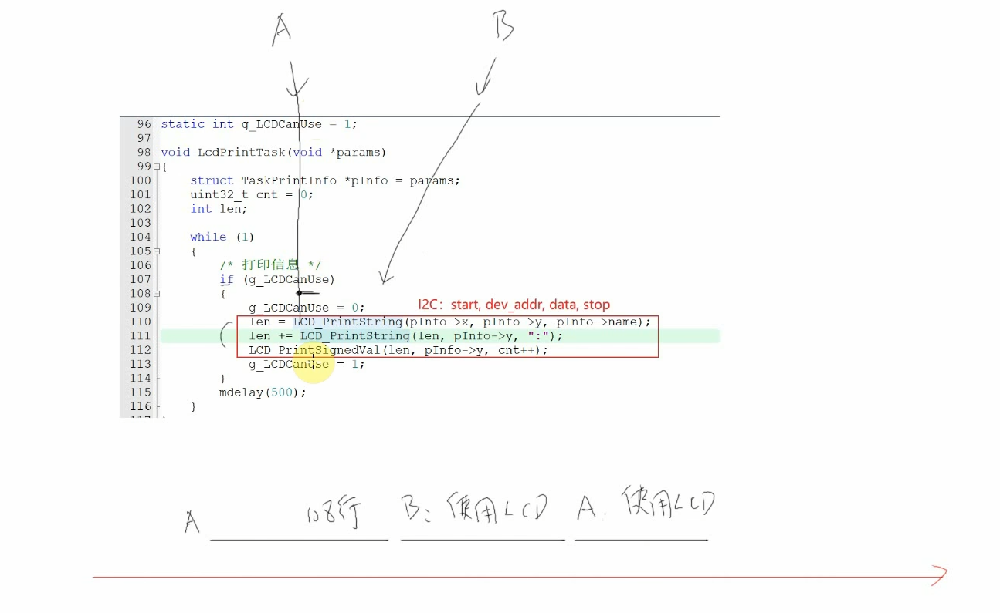
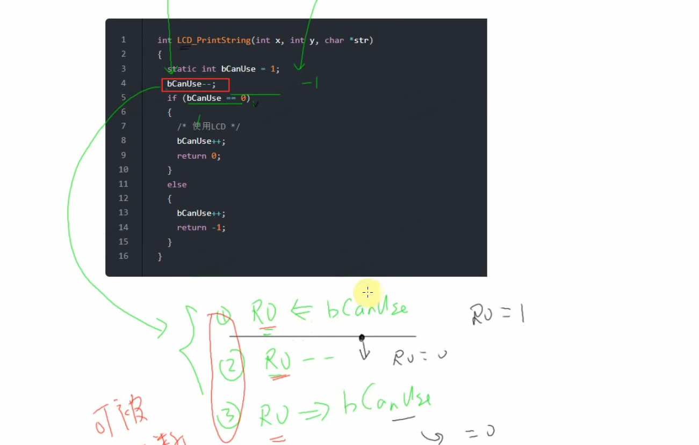
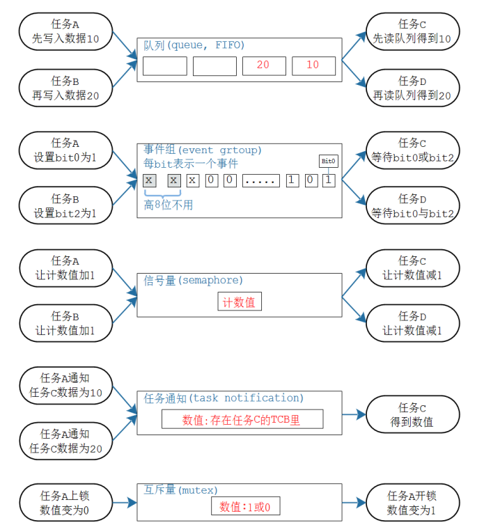

# [FreeRTOS]Day6

## 同步与互斥

互斥：两个任务不能同时访问资源

同步：协调各个任务的执行节奏，常用来实现互斥

### 全局变量实现同步

实现：任务1计算前10’000‘000个自然数之和，任务2等待任务1计算完成后打印结果和时间，使用一个全局信号量`g_CalEnd`实现同步

```c
// 任务函数：计算前10000000个数字之和
static uint32_t g_sum = 0;
static uint8_t g_CalEnd = 0;
static uint64_t g_CalTime = 0;
void CalTask(void *param)
{
	uint32_t i = 0;
	g_CalTime = system_get_ns();
	
	for(i = 0; i < 10000000; i ++) {
		g_sum += i;
	}
	g_CalEnd = 1;
	g_CalTime = system_get_ns() - g_CalTime;
	vTaskDelete(NULL);
}

// 任务函数：在OLED指定位置打印
static uint8_t g_LCDCanUse = 1;

void OLEDPrintTask(void *param)
{
	uint8_t len;
	
	while(1) {
		// 等待计算完成
		LCD_PrintString(0, 0, "Waiting");
		while(g_CalEnd == 0);
		
		/* 打印信息 */
		if(g_LCDCanUse) {
			g_LCDCanUse = 0;
			
			LCD_ClearLine(0, 0);
			len = LCD_PrintString(0, 0, "Sum:");
			LCD_PrintSignedVal(len, 0, g_sum);
			
			LCD_ClearLine(0, 2);
			len = LCD_PrintString(0, 2, "Time(ns):");
			LCD_PrintSignedVal(len, 2, g_CalTime);
			
			g_LCDCanUse = 1;
		}
		vTaskDelete(NULL);
	}
}

xTaskCreate(CalTask, "CalTask", 128, NULL, osPriorityNormal, NULL);
xTaskCreate(OLEDPrintTask, "Task2", 128, NULL, osPriorityNormal, NULL);
```

烧录后不能正确执行，使用`volatile`让编译器不要优化全局变量`g_CalEnd`，避免将`g_CalEnd`的值存入寄存器，在后续执行过程中只读取寄存器而不是内存，导致读不到更新后的值

使用十六进制打印结果，以毫秒为单位打印时间

```c
LCD_PrintHex(len, 0, g_sum, 1);

LCD_ClearLine(0, 2);
len = LCD_PrintString(0, 2, "Time(ms):");
LCD_PrintSignedVal(len, 2, g_CalTime / 1000000);
```

时间为2066ms，计算任务`CalTask`真得需要这么长时间吗

实际任务调度


可知任务A大约需要1000ms，让任务2开始时阻塞2000ms，可以使A持续运行，最终打印时间1054ms

```c
while(1) {
		// 等待计算完成
		LCD_PrintString(0, 0, "Waiting");
		vTaskDelay(2000);
		while(g_CalEnd == 0);
}
```

由此可知：**使用简单的全局变量实现任务同步会导致CPU资源浪费**

### 互斥

**临界资源**：同一时间段内只能有一个任务访问的资源

使用一个全局变量实现任务互斥访问临界资源时存在缺陷



如果任务AB的切换发生在108行，会导致AB都可以使用LCD，IIC时序混乱。引起这个缺陷的原因：对于全局变量的判断和更改可能被打断

即使是一条C语句，在汇编语言的角度也不是原子操作



解决这个问题的一个方法是，在判断和更改之前关闭中断，防止发生任务切换

```c
int LCD_PrintString(int x, int y, char *str)
{
	static int bCanUse = 1;
    disable_irq();
	if (bCanUse) {
		bCanUse = 0;
		enable_irq();
		/* 使用LCD */
		bCanUse = 1;
		return 0;
	}
	enable_irq();
	return -1;
}
```

这种方法仍然存在问题：在使用LCD前开启了中断，这样A访问LCD时会发生任务切换，只是B一直检测到`bCanUse`为0，无法使用，但是还是会浪费CPU资源

好的状态：A访问LCD，发生切换，B检测到LCD无法使用，进入阻塞态，之后不会发生切换，等到A使用结束之后，唤醒B，B使用LCD

## 任务间通信

