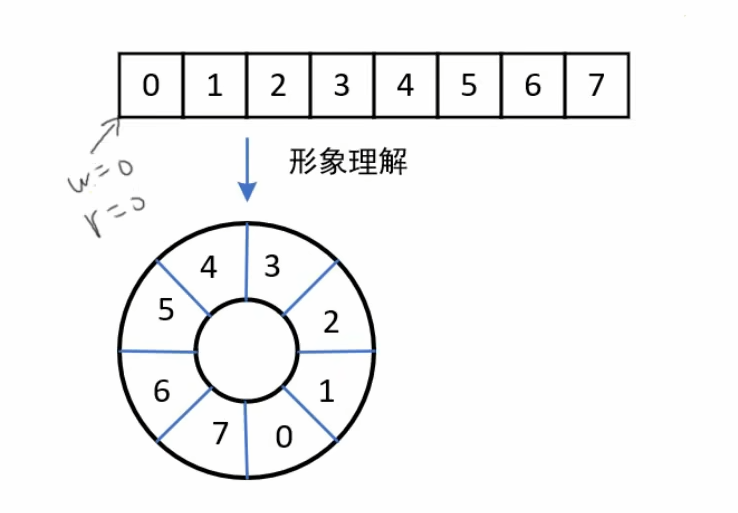
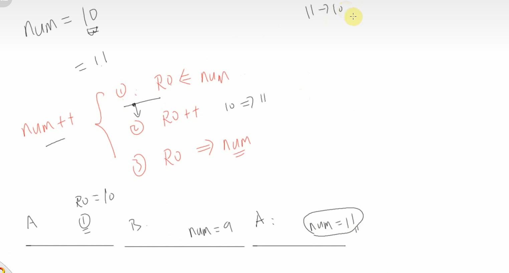
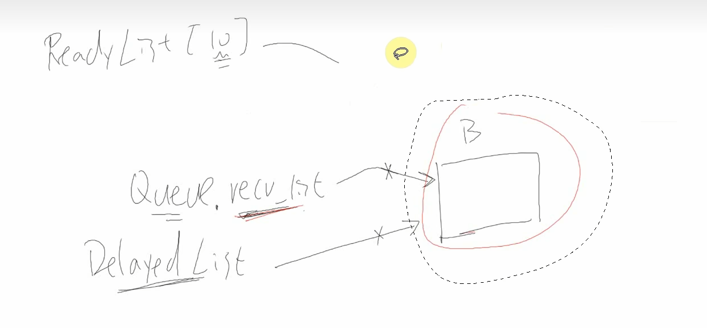

# [FreeRTOS]Day8-Part1

## 队列

### 任务之间如何传输数据

|            | 数据个数 | 互斥措施 | 阻塞-唤醒 |
| ---------- | -------- | -------- | --------- |
| 全局变量   | 1        | 无       | 无        |
| 环形缓冲区 | 多个     | 无       | 无        |
| 队列       | 多个     | 有       | 有        |

使用全局变量：对于`TaskA`和`TaskB`，如果使用全局变量来进行数据传输，一个全局变量只能传递一个数据，并且没有互斥措施，没有阻塞与唤醒

环形缓冲区用于在**两个**任务之间传递数据。环形缓冲区是一个**循环数组**，例如定义一个数组`int buf[8]`表示环形缓冲区，两个指针`r = 0`和`w = 0`分别指示下一次读和写的位置



**缓冲区为空**的条件：`r == w`

**缓冲区满**的条件：`(w + 1) % BufSize == r`，当`w`指向环形数组中`r`的前一个位置时表示数组满，数组利用率为BufSize - 1

**读操作和写操作**：

```c
const int BufSize = 8;

int BufRead(void) {
    int val = -1;
    if(r != w) {		// 如果缓冲区不空
        val = buf[r];
        r = (r + 1) % BufSize;
    }
    return val;
}

int BufWrite(int val) {
    int flag = -1;
    if((w + 1) % BufSize != r) {				// 如果缓冲区不满
        buf[w] = val;
        w = (w + 1) % BufSize;
        flag = 1;
    }
    return flag;
}
```

使用全局变量`num`记录缓冲区元素个数，以此判断缓冲区空/满的缺陷：多个任务同时访问全局变量，可能导致出错



### 队列的本质

队列中，数据的读写本质就是唤醒缓冲区，在这个基础上增加了互斥措施、阻塞-唤醒机制

和环形缓冲区一样，队列有读位置`r`和写位置`w`，另外队列增加了保护措施，所以可以有元素个数`num`

如果这个队列不传输数据，只调整“数据个数`num`”，它就是**信号量（semaphore）**

如果**信号量中**限制“数据个数”的最大值为1，它就是**互斥量（mutal exclusion, mutex）**

队列相关操作：**创建、写队列、读队列**

`TaskA`写队列，`TaskB`读队列，则`TaskA`可能的操作有

- 写队列
- 若队列满，阻塞
- 队列不满时被唤醒/超时时间到被唤醒

`TaskB`可能的操作有

- 读队列
- 若队列空，阻塞
- 队列不空时被唤醒/超时时间到被唤醒

**队列组成部分**

- 环形缓冲区
- 两个链表：`SenderList`存放队列满时希望写队列的任务，用于队列不满时将这些任务唤醒；`ReceiverList`存放队列空时希望读队列的任务，用于队列不空时将这些任务唤醒



尝试读队列进程所在链表切换：

一个处于就绪链表的任务尝试读队列，但此时队列为空，该任务被从就绪链表删除，删除操作由自己执行，加入到阻塞链表，同时被加入到队列接收链表`QueueReciverList`，当以下情况发生时，该任务重新回到就绪链表：

- 队列不空，任务进行读队列操作
- 超时时间到，读队列函数返回错误值

## 队列实验

在02_nwatch_game_freertos.7z的基础上，改出8-1QueueGame，实现使用红外遥控器，旋转编码器玩游戏

实验方案：

- 游戏任务：读取队列A获得控制信息，用来控制游戏
- 红外遥控器驱动：在中断函数里解析出按键后，写队列A
- 旋转编码器：中断函数里解析出旋转编码器的状态，写队列B         任务函数里，读队列B，构造好数据后写队列A

### 队列相关函数

#### 创建队列

与任务创建函数一样，队列创建函数也分动态分配内存和静态分配内存

```c
// 动态分配内存队列创建函数
QueueHandle_t xQueueCreate(			// 成功返回：句柄	失败返回：NULL
    UBaseType_t uxQueueLength, 		// 队列长度
    UBaseType_t uxItemSize			// 每个数据(item)大小，以字节为单位
	);

// 静态分配内存队列创建函数
QueueHandle_t xQueueCreateStatic(	// 成功返回：句柄	失败返回：NULL
    UBaseType_t uxQueueLength,		// 队列长度
    UBaseType_t uxItemSize,			// 每个数据(item)大小，以字节为单位
    uint8_t *pucQueueStorageBuffer,	// 如果uxItemSize非零，pucQueueStorageBuffer必须指向一个uint8_t数组，数组大小至少为uxQueueLength * uxItemSize
    StaticQueue_t *pxQueueBuffer	// 执行一个 StaticQueue_t 结构体，用来保存队列的数据结构
    )
```

#### 读队列

使用`xQueueReceive()`函数读队列，读到一个数据后，队列中该数据会被移除。这个函数有两个版本：在任务中使用，在ISR中使用

```c
BaseType_t xQueueReceive( 		// 返回值：pdPASS->成功读出数据，errQUEUE_EMPTY->队列空
    QueueHandle_t xQueue,		// 确定读哪个队列
    void * const pvBuffer,		// 队列的数据会被复制到这个buffer
    TickType_t xTicksToWait 	// 设置超时时间
    );
BaseType_t xQueueReceiveFromISR(
    QueueHandle_t xQueue,
    void *pvBuffer,
    BaseType_t *pxTaskWoken
    );

```

#### 写队列

可以把数据写到队列头部，也可以写到队列尾部；可以在任务中使用，在中断服务程序ISR（Iterrupt Service Routine）中使用

```c
BaseType_t xQueueSend(
    QueueHandle_t xQueue,
    const void *pvItemToQueue,		// 要写入的数据
    TickType_t xTicksToWait
    );

```

### 红外遥控器玩游戏

当前逻辑：红外遥控中断写环形缓冲区，挡球板任务读环形缓冲区，无阻塞与唤醒，CPU利用率低

改造步骤：

- 创建队列
- 红外遥控中断写队列
- 挡球板任务读队列

```c
// 定义队列item
struct input_data {
	uint32_t dev;
	uint32_t val;
};

QueueHandle_t g_xQueuePlatform;		// 挡球板队列

/* 创建队列 */
g_xQueuePlatform = xQueueCreate(10, sizeof(struct input_data));

struct input_data idata;		// 存放读出的数据

// 读队列
/* 读取红外遥控器 */
// if (0 == IRReceiver_Read(&dev, &data))
/* 读取队列：知道队列不空，成功读取数据 */
if(xQueueReceive(g_xQueuePlatform, &idata, portMAX_DELAY) == pdPASS)
    data = idata.val;

// 写队列
```

修改红外接收器的中断回调函数，写环形缓冲区 -> 写队列

```c
// 声明外部变量
extern QueueHandle_t g_xQueuePlatform;		// 挡球板队列

// 存放写入的数据
struct input_data idata;

/* device: 0, val: 0, 表示重复码 */
// 写环形缓冲区
// PutKeyToBuf(0);
// PutKeyToBuf(0);
// 写队列
idata.dev = 0;
idata.val = 0;
xQueueSendToBackFromISR(g_xQueuePlatform, &idata, 0);		// 等待时间设置为0，如果队列满，直接返回错误

// 修改其他位置
// PutKeyToBuf(datas[0]);
// PutKeyToBuf(datas[2]);
idata.dev = datas[0];
idata.val = datas[2];
xQueueSend(g_xQueuePlatform, &idata, 0);

// driver_irr_receiver.c
#include "FreeRTOS.h"
#include "queue.h"
#include "typedefs.h"
```

### 旋转编码器玩游戏

实验目的：增加使用旋转编码器玩游戏功能

实现方案：

- 游戏任务：读取队列A，控制游戏
- 红外遥控器：写队列A
- 旋转编码器：中断函数中解析出旋转编码器的状态，写队列B；任务函数中，读取队列B，构造好之后写队列A

```c
// game1.c
QueueHandle_t g_xQueueRotaryEncoder;		// 旋转编码器队列

// 使用静态内存分配函数创建旋转编码器的队列
// typedefs.h
// 旋转编码器队列存放的item
struct rotaryEncoder_data {
	int32_t cnt;
	int32_t speed;
};
// game1.h
// 静态分配内存队列创建函数创建RotaryEncoder队列需要的参数
static uint8_t g_ucQueueRotaryEncoderBuf[10 * sizeof(struct rotaryEncoder_data)];
static StaticQueue_t g_xQueueRotaryStaticStruct;
g_xQueueRotaryEncoder = xQueueCreateStatic(10, sizeof(struct rotaryEncoder_data), g_ucQueueRotaryEncoderBuf, &g_xQueueRotaryStaticStruct);

// 修改RotaryEncoder中断函数
// driver_rotary_encoder.c
#include "FreeRTOS.h"
#include "queue.h"
#include "typedefs.h"
extern  QueueHandle_t g_xQueueRotaryEncoder;		// 旋转编码器队列

struct rotaryEncoder_data rdata;
// 写队列
rdata.cnt = g_count;
rdata.speed = g_speed;
xQueueSendToBackFromISR(g_xQueueRotaryEncoder, &rdata, NULL);

// game1.c
// 创建任务
xTaskCreate(RotaryEncoderTask, "RotaryEncoderTask", 128, NULL, osPriorityNormal, NULL);

// game1.c
// 旋转编码器任务函数
// RotaryEncoder任务函数
static void RotaryEncoderTask(void *params)
{
	struct rotaryEncoder_data rdata;
	struct input_data idata;
	uint8_t isLeft;
	int cnt;
	
	// 读RotaryEncoder队列
	xQueueReceive(g_xQueueRotaryEncoder, &rdata, portMAX_DELAY);
	
	// 处理数据
	// 判断速度：速度 < 0 -> 左移，否则右移
	if(rdata.speed < 0) {
		isLeft = 1;
		rdata.speed = 0 - rdata.speed;
	} else {
		isLeft = 0;
	}
	
	cnt = rdata.speed / 10;
	if(!cnt) {
		cnt = 1;
	}
	idata.dev = 1;
	idata.val = isLeft ? 0xe0 : 0x90;
	for(int i = 0; i < cnt; i ++) {
		// 写Platform队列
		xQueueSend(g_xQueuePlatform, &idata, 0);
	}
	
}
```

遇到问题：任务函数`RotaryEncoderTask`没有死循环，导致旋转编码器旋转后整个系统卡死

```c
// RotaryEncoder任务函数
static void RotaryEncoderTask(void *params)
{
	struct rotaryEncoder_data rdata;
	struct input_data idata;
	uint8_t isLeft;
	int i, cnt;
	
	while(1) {
		// 读RotaryEncoder队列
		xQueueReceive(g_xQueueRotaryEncoder, &rdata, portMAX_DELAY);
		
		// 处理数据
		// 判断速度：速度 < 0 -> 左移，否则右移
		if(rdata.speed < 0) {
			isLeft = 1;
			rdata.speed = 0 - rdata.speed;
		} else {
			isLeft = 0;
		}
		
		cnt = rdata.speed / 10;
		if(!cnt) {
			cnt = 1;
		}
		idata.dev = 1;
		idata.val = isLeft ? 0xe0 : 0x90;
		for(i = 0; i < cnt; i ++) {
			// 写Platform队列
			xQueueSend(g_xQueuePlatform, &idata, 0);
		}
	}
	
}
```

### 优化

修改挡球板队列`g_xQueuePlatform`中的数据格式

```c
#define UPT_MOVE_NONE	0
#define UPT_MOVE_RIGHT	1
#define UPT_MOVE_LEFT	2

struct input_data {
	uint32_t dev;
	uint32_t val;		// 存放左或右
};
```

红外遥控器写队列时，`val`要为动作

```c
idata.dev = datas[0];
	if(datas[2] == 0xe0) {			// 左移
		idata.val = UPT_MOVE_LEFT;
	} else if(datas[2] == 0x90) {
		idata.val = UPT_MOVE_RIGHT;		// 右移
	} else {
		idata.val = UPT_MOVE_NONE;		// 不动
	}
	xQueueSendToBackFromISR(g_xQueuePlatform, &idata, NULL);
```

旋转编码器写队列时，写入动作

```c
while(1) {
		// 读RotaryEncoder队列
		xQueueReceive(g_xQueueRotaryEncoder, &rdata, portMAX_DELAY);
		
		// 处理数据
		// 判断速度：速度 < 0 -> 左移，否则右移
		if(rdata.speed < 0) {
			isLeft = 1;
			rdata.speed = 0 - rdata.speed;
		} else {
			isLeft = 0;
		}
		
		cnt = rdata.speed / 10;
		if(!cnt) {
			cnt = 1;
		}
		idata.dev = 1;
		idata.val = isLeft ? UPT_MOVE_LEFT : UPT_MOVE_RIGHT;
		for(i = 0; i < cnt; i ++) {
			// 写Platform队列
			xQueueSend(g_xQueuePlatform, &idata, 0);
		}
	}
```

挡球板任务

```c
/* 挡球板任务 */
static void platform_task(void *params)
{
    byte platformXtmp = platformX;    
    uint8_t dev, data, last_data;
	struct input_data idata;

    // Draw platform
    draw_bitmap(platformXtmp, g_yres - 8, platform, 12, 8, NOINVERT, 0);
    draw_flushArea(platformXtmp, g_yres - 8, 12, 8);
    
    while (1)
    {
        /* 读取红外遥控器 */
		// if (0 == IRReceiver_Read(&dev, &data))
		/* 读取队列，直到读取成功 */
		xQueueReceive(g_xQueuePlatform, &idata, portMAX_DELAY);
		
		uptMove = idata.val;
		// Hide platform
		draw_bitmap(platformXtmp, g_yres - 8, clearImg, 12, 8, NOINVERT, 0);
		draw_flushArea(platformXtmp, g_yres - 8, 12, 8);
		
		// Move platform
		if(uptMove == UPT_MOVE_RIGHT)
			platformXtmp += 3;
		else if(uptMove == UPT_MOVE_LEFT)
			platformXtmp -= 3;
		uptMove = UPT_MOVE_NONE;
		
		// Make sure platform stays on screen
		if(platformXtmp > 250)
			platformXtmp = 0;
		else if(platformXtmp > g_xres - PLATFORM_WIDTH)
			platformXtmp = g_xres - PLATFORM_WIDTH;
		
		// Draw platform
		draw_bitmap(platformXtmp, g_yres - 8, platform, 12, 8, NOINVERT, 0);
		draw_flushArea(platformXtmp, g_yres - 8, 12, 8);
		
		platformX = platformXtmp;
    }
}
```

红外遥控器重复码的处理

```c
static uint32_t g_lastVal;
// drevier_ir_receiver.c  IRReceiver_IRQTimes_Parse() 
g_lastVal = idata.val;			// 记录上一次的值

// drevier_ir_receiver.c	IRReceiver_IRQ_Callback()
/* 是否重复码 */
if (isRepeatedKey())
{
    /* device: 0, val: 0, 表示重复码 */
    // 写环形缓冲区
    // PutKeyToBuf(0);
    // PutKeyToBuf(0);
    // 写队列
    idata.dev = 0;
    idata.val = g_lastVal;;
    xQueueSendToBackFromISR(g_xQueuePlatform, &idata, NULL);
    g_IRReceiverIRQ_Cnt = 0;
}
```

优化旋转编码器速度

```c
// game1.c	RotaryEncoderTask()
cnt = rdata.speed / 10;
if(!cnt) {
    cnt = 1;
}
// 修改为
if(rdata.speed > 100) {
    cnt = 4;
} else if(rdata.speed > 50) {
    cnt = 2; 
} else {
    cnt = 1;
}
```

优化旋转编码器控制

```c
// driver_rotary_encoder.c
// mdelay(2);
if(time - pre_time < 2000000) {			// 当前中断时间与上次中断时间间隔小于2ms，不处理
    pre_time = time;
    return ;
}

if(g_speed == 0) {
    g_speed = 1;
}
```

