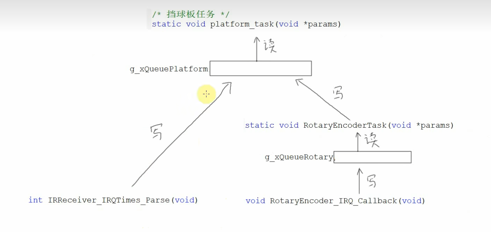
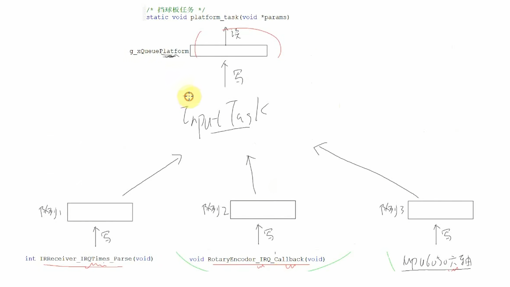
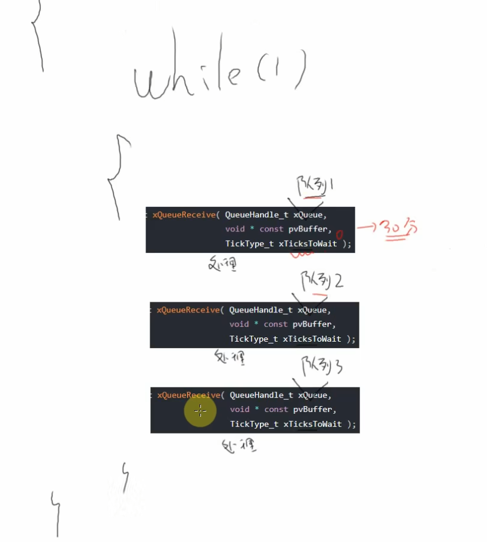
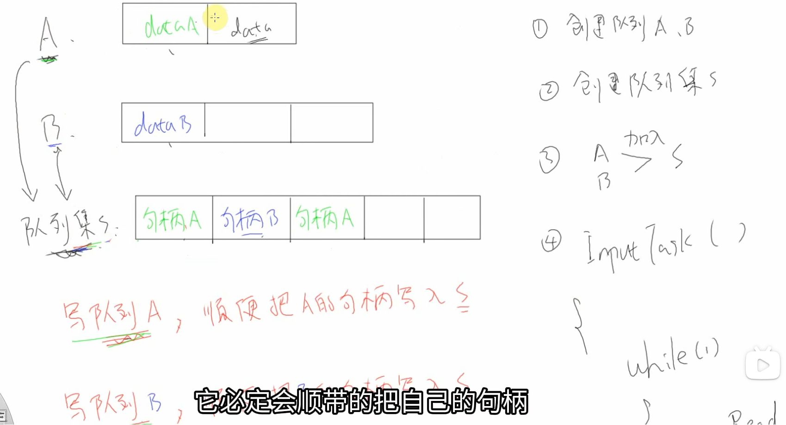
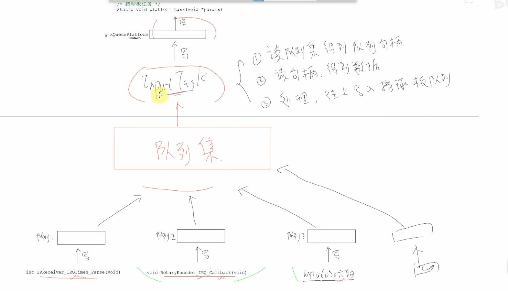
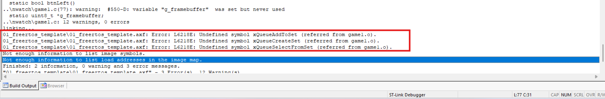

# [FreeRTOS]Day8-Part2

## 使用队列集优化程序框架

### 队列集

当前程序框架



当前`IRReceiver`直接写挡球板任务读取的队列，驱动代码中有

```c
idata.dev = datas[0];
if(datas[2] == 0xe0) {			// 左移
    idata.val = UPT_MOVE_LEFT;
} else if(datas[2] == 0x90) {
    idata.val = UPT_MOVE_RIGHT;		// 右移
} else {
    idata.val = UPT_MOVE_NONE;		// 不动
}
g_lastVal = idata.val;			// 记录上一次的值
xQueueSendToBackFromISR(g_xQueuePlatform, &idata, NULL);
```

导致驱动代码与任务高耦合，如果任务不再是玩游戏，就需要修改驱动代码

`RotaryEncoder`只向自己的队列`g_xQueueRotary`写数据，数据转换位于任务`RotaryEncoderTask`，驱动与应用耦合度低，但如果都采取这种方式，每一个硬件都对应一个专门的任务，会导致内存不足

理想的程序框架：各硬件写各自的队列，由一个任务负责从这些队列中读取数据并转换，写入应用程序使用的队列



`InputTask`如何读取所有队列呢？

如果使用轮询，为了实时性，各个队列读取函数的超时时间必须设置为0，避免等待超时时错过其他队列新进的数据，这样导致该任务一直运行，如果所有队列都一直没有数据，该任务又不会阻塞，使CPU效率降低



使用**队列集**：队列集本质上也是一个队列，存放的是各个队列的句柄。假设一个队列集S，包含队列A和队列B，当队列A中有数据写入时，写入函数，如`xQueueSend()`会判断该队列是否输入某个队列集，判断结果为队列集S，就将队列A的句柄写入队列集S



**目标框架**



#### 红外接收IR_Receiver驱动

定义一个红外接收器队列 -> 数据存放到这个队列

```c
// driver_ir_receiver.h
#define IR_QUEUE_LEN 10

// driver_ir_receiver.c
static QueueHandle_t g_xQueueIRReceiver;		// 红外接收器队列

QueueHandle_t GetQueueIR(void)
{
	return g_xQueueIRReceiver;
}

struct ir_data {
	uint32_t dev;
	uint32_t val;	
};

// 创建红外接收器队列
g_xQueueIRReceiver = xQueueCreate(IR_QUEUE_LEN, sizeof(struct ir_data);

// 解析完成后直接存放
idata.dev = datas[0];
idata.val = datas[2];
xQueueSendToBackFromISR(g_xQueueIRReceiver, &idata, NULL);

// 重复码处理
/* device: 0, val: 0, 表示重复码 */
// 写环形缓冲区
// PutKeyToBuf(0);
// PutKeyToBuf(0);
// 写队列
idata.dev = 0;
idata.val = 0;
```

#### 旋转编码器

```c
// driver_rotary_encoder.h
#define ROTARY_QUEUE_LEN 10

// driver_rotary_encoder.c
static  QueueHandle_t g_xQueueRotaryEncoder;		// 旋转编码器队列

QueueHandle_t GetQueueRotary(void)
{
	return g_xQueueRotaryEncoder;
}

// 旋转编码器队列存放的item
struct rotaryEncoder_data {
	int32_t cnt;
	int32_t speed;
};

void RotaryEncoder_Init(void)
{
    /* PB0,PB1在MX_GPIO_Init中被配置为输入引脚 */
    /* PB12在MX_GPIO_Init中被配置为中断引脚,上升沿触发 */
	// 静态分配内存队列创建函数创建RotaryEncoder队列需要的参数
	static uint8_t g_ucQueueRotaryEncoderBuf[10 * sizeof(struct rotaryEncoder_data)];
	static StaticQueue_t g_xQueueRotaryStaticStruct;
	
	g_xQueueRotaryEncoder = xQueueCreateStatic(ROTARY_QUEUE_LEN, sizeof(struct rotaryEncoder_data), g_ucQueueRotaryEncoderBuf, &g_xQueueRotaryStaticStruct);
}
```

#### game1中创建队列、队列集和任务

```c
static QueueSetHandle_t g_xQueueSetInput;		// 输入设备的队列集

/* 创建队列，队列集，输入任务 */
g_xQueuePlatform = xQueueCreate(10, sizeof(struct input_data));
g_xQueueSetInput = xQueueCreateSet(IR_QUEUE_LEN + ROTARY_QUEUE_LEN);
// 把队列加入队列集
g_xQueueIR = GetQueueIR();
g_xQueueRotary = GetQueueRotary();
xQueueAddToSet(g_xQueueIR, g_xQueueSetInput); 
xQueueAddToSet(g_xQueueRotary, g_xQueueSetInput); 

// 创建任务
xTaskCreate(InputTask, "InputTask", 128, NULL, osPriorityNormal, NULL);

// InputTask框架
static void InputTask(void *params) {
    while(1) {
		// 读队列集，得到有数据的队列句柄
		
		// 读队列，得到数据
		
		// 处理数据
		
		// 写挡球板队列
	}
}

// Input任务函数
static void InputTask(void *params)
{
	QueueSetMemberHandle_t xQueueHandle;		// 存放有数据的队列的句柄
	
	while(1) {
		// 读队列集
		xQueueHandle = xQueueSelectFromSet(g_xQueueSetInput, portMAX_DELAY);	// 一直等待
		
		if(xQueueHandle) {
			// 读取指定队列，并处理数据，写挡球板队列
			if(xQueueHandle == g_xQueueIR) {		// 红外遥控器
				ProcessIRData();
			} else if(xQueueHandle == g_xQueueRotary) {			// 旋转编码器
				ProcessRotaryData();
			}
		}
	}
	
}
```

#### 红外遥控器、旋转编码器读取队列，数据处理与写入

```c
// 红外遥控器队列读取，处理，写入挡球板队列函数
static void ProcessIRData(void) 
{
	struct ir_data idata;
	static struct input_data input;
	
	xQueueReceive(g_xQueueIR, &idata, 0);
	
	if(idata.val == IR_KEY_LEFT) {
		input.dev = idata.dev;
		input.val = UPT_MOVE_LEFT;
	} else if(idata.val == IR_KEY_RIGHT) {
		input.dev = idata.dev;
		input.val = UPT_MOVE_RIGHT;
	} else if(idata.val == IR_KEY_REPEAT) {
		// 保持不变
	} else {
		input.dev = idata.dev;
		input.val = UPT_MOVE_NONE;
	}
	
	// 写挡球板队列
	xQueueSend(g_xQueuePlatform, &input, 0);
}

// 旋转编码器队列读取，处理，写入挡球板队列函数
static void ProcessRotaryData(void) 
{
	struct rotaryEncoder_data rdata;
	static struct input_data input;
	int left;
	int i, cnt;
	
	xQueueReceive(g_xQueueRotary, &rdata, 0);
	
	// 判断方向
	if(rdata.speed < 0) {
		left = 1;
		rdata.speed = 0 - rdata.speed;
	} else {
		left = 0;
	}
	
	// 确定移动次数
	if(rdata.speed > 100) {
		cnt = 4;
	} else if(rdata.speed > 50) {
		cnt = 2;
	} else {
		cnt = 1;
	}
	
	// 写挡球板队列
	input.dev = 1;
	input.val = left ? UPT_MOVE_LEFT : UPT_MOVE_RIGHT;
	for(i = 0; i < cnt; i ++) {
		// 写挡球板队列
		xQueueSend(g_xQueuePlatform, &input, 0);
	}
}
```

#### 配置队列集

报错



说明队列集相关函数没有定义，要先在STM32CubeMX中配置队列集

 在`FreeRTOSConfig.h`中添加

```c
#define configUSE_QUEUE_SETS 1
```

#### 解决挡球板不出现的问题

增大堆的大小到10000

