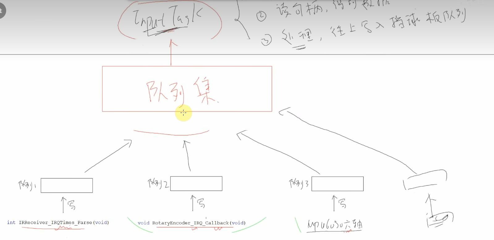

# [FreeRTOS]Day8-Part3

## 增加姿态控制

整体框架



IR Receiver和Rotary Encoder的实现方法：在中断函数中向自己的队列写数据，创建一个包含这些队列的队列集，`InputTask()`读取队列集 -> 读对应的队列 -> 写入目标队列

MPU 6050不使用在中断函数中写队列的方法实现，而是创建一个任务，读取I2C、写队列

```c
// 创建任务写MPU6050队列
Task()
{
    while(1) {
        // 读I2C
        
        // 写队列
        
        vTaskDelay();
    }
}

// 将队列加入队列集

// InputTask进行数据处理，写挡球板队列
```

### MPU6050写自己队列的任务

```c
// 任务函数：driver_mpu6050.c
void MPU6050_Task(void *params)
{
	int16_t AccX;
	struct mpu6050_data result;
	
	while(1) {
		
		// 读数据
		if(MPU6050_ReadData(&AccX, NULL, NULL, NULL, NULL, NULL) == 0) {
			
			// 解析数据
			MPU6050_ParseData(AccX, 0, 0, 0, 0, 0, &result);
			
			// 写队列
			xQueueSend(g_xQueueMPU6050, &result, 0);
		}
		
		// Delay
		vTaskDelay(50);
	}
}

// 创建任务：freertos.c
xTaskCreate(MPU6050Task, "MPU6050Task", 128, NULL, osPriorityNormal, NULL);
```

创建成功后，`MPU6050Task`就会不断地读取MPU6050的数据，写入MPU6050的队列

### 将MPU6050队列加入队列集

```c
g_xQueueMPU6050 = GetQueueMPU6050();
xQueueAddToSet(g_xQueueMPU6050, g_xQueueSetInput); 
```

### InputTask进行数据读取和处理

```c
 else if(xQueueHandle == g_xQueueMPU6050) {			// 旋转编码器
    ProcessMPU6050Data();
}

// MPU6050队列读取，处理，写入挡球板队列函数
static void ProcessMPU6050Data(void) 
{
	struct mpu6050_data mdata;
	static struct input_data input;
	int i, cnt;
	
	xQueueReceive(g_xQueueMPU6050, &mdata, 0);
	
	// 判断方向，大于90度左移，小于90度右移
	if(mdata.angle_x > 90) {
		input.val = UPT_MOVE_LEFT;
	} else if(mdata.angle_x < 90) {
		input.val = UPT_MOVE_RIGHT;
	} else {
		input.val = UPT_MOVE_NONE;
	}
	
	// 写挡球板队列
	input.dev = 2;
	xQueueSend(g_xQueuePlatform, &input, 0);
}

```

## 汽车游戏

实现功能：按键1/2/3分别控制汽车1/2/3向右移动

实现思路：IRReceiver收到按键信号后写一个硬件队列 -> 写多个队列

每个汽车的控制是一个应用，对应一个任务，都要有自己的队列，任务对每个应用的队列进行读取

如何实现IRReceiver写多个队列呢？

实现一个数据分发函数`DispatchKey()`，在其中实现各个队列的写入。

如果队列很多，难道需要重复调用`xQueueSendFromISR()`很多次吗？

在驱动`driver_ir_receiver.c`中实现一个全局变量`g_xQueues[]`数组，保存IRReceiver要写入的所有队列句柄，再实现一个注册函数`RegisterQueueHandle()`每个应用将自己的队列进行注册，使得IRReceiver能够向该队列写入

```c
void RegisterQueueHandle(QueueHandle_t queueHandle)
{
	if(g_queue_cnt < 10) {
		g_xQueues[g_queue_cnt] = queueHandle;
		g_queue_cnt ++;
	}
}

static void DispatchKey(struct ir_data *pidata)
{
	int i;
	for(i = 0; i < g_queue_cnt; i ++) {
		xQueueSendFromISR(g_xQueues[i], pidata, NULL);
	}
}
```

**为什么每个任务都要有自己的队列，不能都读取`g_xQueueIR`吗？**

如果各个任务使用同一个队列，`xQueueReceive()`从队列中读出数据后，将数据从队列移除，导致其他任务无法读取到数据

```c
void car_game()
{
	int x, i, j;
	g_framebuffer = LCD_GetFrameBuffer(&g_xres, &g_yres, &g_bpp);
    draw_init();
    draw_end();
	
	// 绘制路标
	for(i = 0; i < 3; i ++) {
		for(j = 0; j < 8; j ++) {
			draw_bitmap(16 * j, 16 + 17 * i, roadMarking, 8, 1, NOINVERT, 0);
			draw_flushArea(16 * j, 16 + 17 * i, 8, 1);
		}
	}
	
	// 创建三个汽车任务
	xTaskCreate(CarTask, "car1", 128, &g_cars[0], osPriorityNormal, NULL);
	xTaskCreate(CarTask, "car2", 128, &g_cars[1], osPriorityNormal, NULL);
	xTaskCreate(CarTask, "car3", 128, &g_cars[2], osPriorityNormal, NULL);
}

static void CarTask(void *params)
{
	struct car *pcar = params;
	struct ir_data idata;	
	
	// 创建自己的队列
	QueueHandle_t xQueueIR = xQueueCreate(10, sizeof(struct ir_data));
	// 注册队列：把队列加到IRReceiver中的队列数组里，方便数据分发
	RegisterQueueHandle(xQueueIR);
	
	// 显示汽车
	ShowCar(pcar);
	
	while(1) {
		// 读取按键值
		xQueueReceive(xQueueIR, &idata, portMAX_DELAY);
		
		// 控制按键向右移动
		if(idata.val == pcar->control_key) {
			if(pcar->x < g_xres - CAR_LENGTH) {
				// 隐藏汽车
				HideCar(pcar);
				
				// 调整位置
				pcar->x += 20;
				if(pcar->x > g_xres - CAR_LENGTH) {
					pcar->x = g_xres - CAR_LENGTH;
				}
				
				// 重新显示
				ShowCar(pcar);
			}
		}
	}
}
```