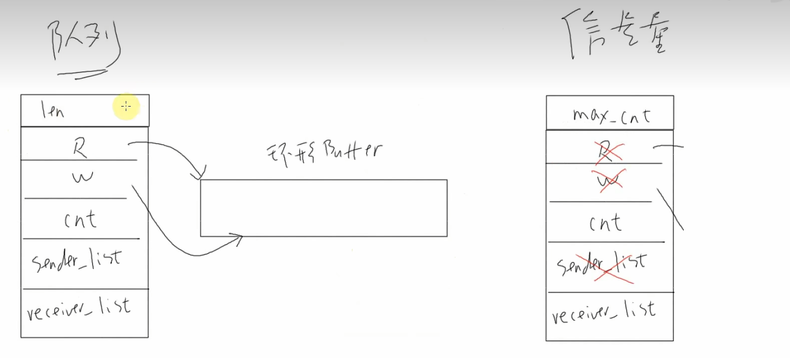
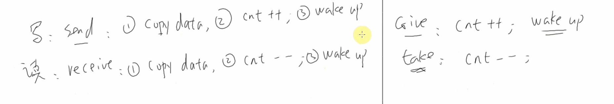
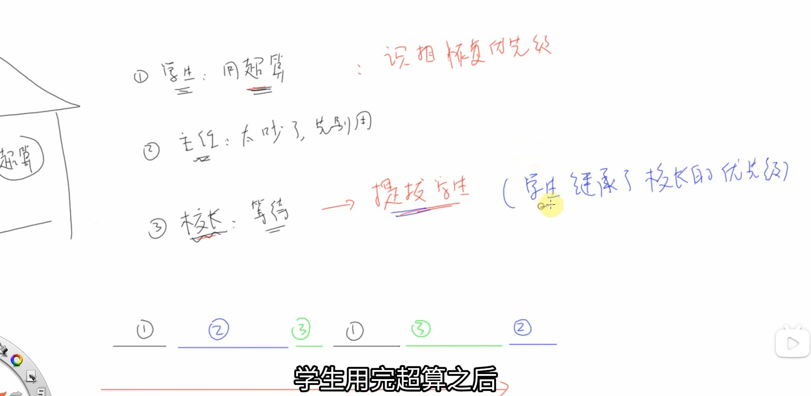
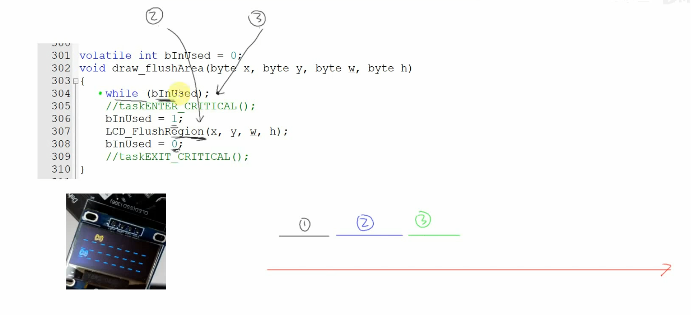

# [FreeRTOS]Day9

## 信号量的本质

信号量的本质是一个**队列**，但不涉及数据传输，只有计数值的增减





信号量的阻塞：执行`take()`操作时，如果cnt值已经为0，将该任务加入阻塞队列和`receiver_list`，cnt值大于0时唤醒或超时唤醒

## 信号量相关操作

### 创建信号量

|          | 二进制信号量                   | 计数型信号量                     |
| -------- | ------------------------------ | -------------------------------- |
| 动态创建 | xSemaphoreCreateBinary()       | xSemaphoreCreateCounting()       |
| 静态创建 | xSemaphoreCreateBinaryStatic() | xSemaphoreCreateCountingStatic() |

各个函数的函数原型

```c
/* 创建一个二进制信号量，返回它的句柄。
* 此函数内部会分配信号量结构体
* 返回值: 返回句柄，非 NULL 表示成功
*/
SemaphoreHandle_t xSemaphoreCreateBinary( void );
/* 创建一个二进制信号量，返回它的句柄。
* 此函数无需动态分配内存，所以需要先有一个 StaticSemaphore_t 结构体，并传入它的
指针
* 返回值: 返回句柄，非 NULL 表示成功
*/
SemaphoreHandle_t xSemaphoreCreateBinaryStatic( StaticSemaphore_t *pxSemaphoreBuffer );

/* 创建一个计数型信号量，返回它的句柄。
* 此函数内部会分配信号量结构体
* uxMaxCount: 最大计数值
* uxInitialCount: 初始计数值
* 返回值: 返回句柄，非 NULL 表示成功
*/
SemaphoreHandle_t xSemaphoreCreateCounting(UBaseType_t uxMaxCount, UBaseType_t uxInitialCount);
/* 创建一个计数型信号量，返回它的句柄。
* 此函数无需动态分配内存，所以需要先有一个 StaticSemaphore_t 结构体，并传入它的
指针
* uxMaxCount: 最大计数值
* uxInitialCount: 初始计数值
* pxSemaphoreBuffer: StaticSemaphore_t 结构体指针
* 返回值: 返回句柄，非 NULL 表示成功
*/
SemaphoreHandle_t xSemaphoreCreateCountingStatic( UBaseType_t uxMaxCount,
    UBaseType_t uxInitialCount,
    StaticSemaphore_t *pxSemaphore
    Buffer );
```

### give/take

|      | 在任务中使用     | 在ISR中使用             |
| ---- | ---------------- | ----------------------- |
| give | xSemaphoreGive() | xSemaphoreGiveFromISR() |
| take | xSemaphoreTake() | xSemaphoreTakeFromISR() |

各函数的函数原型

```c
/* 
xSemaphore：信号量句柄，释放哪个信号量
返回值：pdTRUE表示成功。如果二进制信号量计数值已经为1，或者计数型信号量技术值已经是最大值，返回失败
*/
BaseType_t xSemaphoreGive( SemaphoreHandle_t xSemaphore )

/*
xSemaphore：信号量句柄，释放哪个信号量
pxHigherPriorityTaskWoken：如果释放信号量导致更高优先级的任务变为了就绪态，*pxHigherPriorityTaskWoken = pdTRUE
返回值：pdTRUE表示成功。如果二进制信号量计数值已经为1，或者计数型信号量技术值已经是最大值，返回失败
*/
BaseType_t xSemaphoreGiveFromISR(
    SemaphoreHandle_t xSemaphore,
    BaseType_t *pxHigherPriorityTaskWoken
    );

/* 
xSemaphore：信号量句柄，获取哪个信号量
xTicksToWait：阻塞时间：0：不阻塞，马上返回；portMAX_DELAY: 一直阻塞直到成功
返回值：pdTRUE 表示成功
*/
BaseType_t xSemaphoreTake(
    SemaphoreHandle_t xSemaphore,
    TickType_t xTicksToWait
    );
/*
xSemaphore：信号量句柄，获取哪个信号量
pxHigherPriorityTaskWoken：如果获取信号量导致更高优先级的任务变为了就绪态，*pxHigherPriorityTaskWoken = pdTRUE
返回值：pdTRUE 表示成功
*/
BaseType_t xSemaphoreTakeFromISR(
    SemaphoreHandle_t xSemaphore,
    BaseType_t *pxHigherPriorityTaskWoken
    );
```

## 实验

1.使用信号量控制原本三个小车都能自动移动的游戏变为只有两个小车可以移动

在`car_game()`中创建计数型信号量，指定最大值为3，初始值为2

```c
// game2.c -> car_game()
static SemaphoreHandle_t g_xSemTicks;
// 创建计数型信号量
g_xSemTicks = xSemaphoreCreateCounting(3, 2);
```

小车任务函数中显示小车之后，先获取信号量计数值，`Take()`操作，如果计数值为0，就一直阻塞

```c
// game2.c -> carTask()
// 获得信号量
xSemaphoreTake(g_xSemTicks, portMAX_DELAY);
```

2.实现小车到达最右端后，释放信号量，唤醒左侧小车移动

```c
// game2.c -> carTask()
if(pcar->x == g_xres - CAR_LENGTH) {
    xSemaphoreGive(g_xSemTicks);
    vTaskDelete(NULL);
}
```

将信号量初值设置为1可以实现三辆车依次通过

```c
// game2.c -> car_game()
g_xSemTicks = xSemaphoreCreateCounting(3, 1);
```

3.改用二进制信号量

```c
// game2.c -> car_game()
// 创建计数型信号量
// g_xSemTicks = xSemaphoreCreateCounting(3, 1);
// 创建二进制信号量
g_xSemTicks = xSemaphoreCreateBinary();
// 由于初始值为0，先进行一次Give
xSemaphoreGive(g_xSemTicks);
```

## 优先级反转

一个高优先级任务，因等待一个被低优先级任务占用的共享资源，而被无限期地阻塞，反而让一个中优先级任务抢占了CPU

设计实验实现优先级反转

```c
// game2.c

// car_game()
// 创建三个汽车任务：任务函数不同，优先级不同
xTaskCreate(Car1Task, "car1", 128, &g_cars[0], osPriorityNormal, NULL);
xTaskCreate(Car2Task, "car2", 128, &g_cars[1], osPriorityNormal + 2, NULL);
xTaskCreate(Car3Task, "car3", 128, &g_cars[2], osPriorityNormal + 3, NULL);

// car3Task()
static void Car3Task(void *params)
{
    // 阻塞2秒
    vTaskDelay(2000);
    
    // Take信号量直至成功
    
    // 汽车右移
    
    // Give信号量
}

// car2Task()
static void Car2Task(void *params)
{
    // 阻塞1秒
    vTaskDelay(1000);
    
    // 汽车右移
    //vTaskDelay(50);
	mdelay(50);
    
    // 执行完成后自杀 
    vTaskDelete(NULL);
}

// car1Task()
static void Car2Task(void *params)
{
	// Take信号量
    
    // 汽车右移
    vTaskDelay(50);
    
    // Give信号量
}
```

先执行car3Task() -> 阻塞2秒 -> 执行car2Task -> 阻塞1秒 -> 执行car1Task -> take信号量 -> car2Task被唤醒 -> 执行car2Task -> car3Task被唤醒 -> 信号量为0，阻塞 -> 执行car2Task -> car2Task优先级最高，一直执行 -> 执行完成，继续执行car1Task -> 执行完成，释放信号量 -> car3Task被唤醒 -> 执行car3Task

执行完成顺序：**car2Task -> car1Task -> car3Task**，最高优先级任务最后完成

## 互斥量：解决优先级反转

互斥量是实现了**优先级继承和优先级恢复**的信号量

使用互斥量可以实现优先级继承，高优先级任务让占有信号量的低优先级任务临时具有和自己相同的优先级，使得原本的低优先级任务优先中优先级任务完成，完成后恢复其优先级，高优先级任务由于优先级最高并且信号量不为0，得到运行，中优先级任务最后运行



### 解决优先级反转问题

创建信号量 -> 创建互斥量

```c
// 创建计数型信号量
// g_xSemTicks = xSemaphoreCreateCounting(3, 1);
// 创建二进制信号量
// g_xSemTicks = xSemaphoreCreateBinary();
// 由于初始值为0，先进行一次Give
// xSemaphoreGive(g_xSemTicks);
// 创建互斥量
g_xSemTicks =  xSemaphoreCreateMutex();
```

实验现象：程序卡死

原因：使用全局变量保护临界资源出现了问题



使用互斥量进行对I2C的访问

```c
// freertos.c
void GetI2C(void)
{
	// 等待信号量
	xSemaphoreTake(g_xI2CMutex, portMAX_DELAY);
}

void PutI2C(void)
{
	// 释放信号量
	xSemaphoreGive(g_xI2CMutex);
}

// 定义I2C的互斥量
static SemaphoreHandle_t g_xI2CMutex;

// 创建互斥量
g_xI2CMutex =  xSemaphoreCreateMutex();

// draw.c
extern void GetI2C(void);
extern void PutI2C(void);
void draw_flushArea(byte x, byte y, byte w, byte h)
{
    // while (bInUsed);
    // bInUsed = 1;
	GetI2C();
    LCD_FlushRegion(x, y, w, h);
    // bInUsed = 0;
	PutI2C(); 
}

// driver_mpu6050.c
extern void GetI2C(void);
extern void PutI2C(void);

// 读数据
GetI2C();		// 等待互斥量
ret = MPU6050_ReadData(&AccX, NULL, NULL, NULL, NULL, NULL);
PutI2C();		// 释放互斥量
```

先执行car3Task() -> 阻塞2秒 -> 执行car2Task -> 阻塞1秒 -> 执行car1Task -> take互斥量 -> car2Task被唤醒 -> 执行car2Task -> car3Task被唤醒 -> 信号量为0，设置car1Task优先级与car3Task相同 -> 执行car1Task -> 执行到`vTaskDelay(50)`，阻塞自己 -> 执行car2Task -> car1Task时间到，唤醒 -> ...（car1Task和car2Task交替执行） -> car1Task执行完成，释放互斥量 -> car3Task执行 -> car3Task使用的是`mdelay(50)`，不会发生任务调度 -> car3Task执行完 -> 执行car2Task